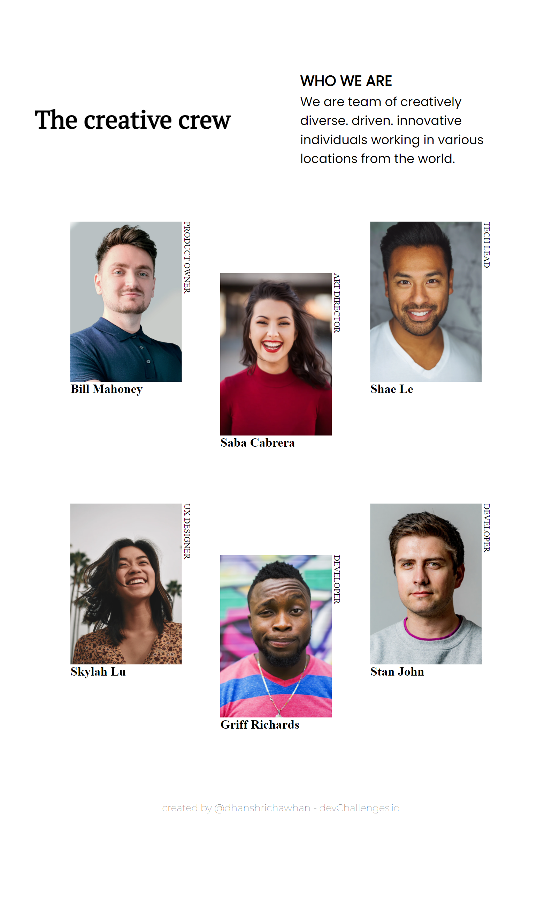

<!-- Please update value in the {}  -->
 
<h1 align="center">My Team Page</h1>
 

   Solution for a challenge from  <a href="http://devchallenges.io" target="_blank">Devchallenges.io</a>.

  <h3>
    <a href="https://my-team-ten-rust.vercel.app/">
      Demo
    </a>
     | 
    <a href="https://github.com/dhanshrichawhan/my_team">
      Solution
    </a>
     | 
    <a href="https://devchallenges.io/challenges/hhmesazsqgKXrTkYkt0U">
      Challenge
    </a>
  </h3>

 
 

  <h2>Desktop View<h2>
   
  
   
   
  <h2>Tablet View<h2>
   
  
   
   
  <h2>Mobile View<h2>
   
  

